# 植被覆盖度时空变化规律分析实例

## 一、数据集

ISLSCP II GIMMS 月度 NDVI 数据集：[点我](https://daac.ornl.gov/ISLSCP_II/guides/gimms_ndvi_monthly_xdeg.html)

* 涵盖了 1981.07 ——2002.12 的数据；
* 该数据集包含三个数据文件，分别以 0.25 、0.5 、1.0 度的经纬度空间分辨率提供；
* 数据集进行了处理，减少了因校准、视图几何、火山气溶的火山平流层气溶胶矫正，以及使用经验模式分解/重建（ EMD ）改进 NDVI 以最小化轨道漂移的影响；
* 数据集空间范围：全局网格
* 经度范围：-180 W —— 180 E ；
* 纬度范围：-90 S —— 90 N ；
* 数据获取地址：[点我](https://search.earthdata.nasa.gov/search/granules?p=C179002875-ORNL_DAAC&pg[0][v]=f&pg[0][gsk]=-start_date&q=gimms&tl=1637818931.017!3!!) ；
* 文件类型：.asc 文件；
* 本实例选择了精度为 0.25 度的数据集；
* 数据中含有负值，-99 表示水体，-88 表示缺失值，-77 表示永久冰值。

Arcgis 的学习建议参考官方文档：[点我](https://resources.arcgis.com/zh-cn/help/) 。

原始数据展示：


## 二、数据处理流程

### 1. 下载文件完整性验证

由于笔者还下载了 MODIS 的数据集，而该数据集是逐条下载的，因此在下载完成后需要判断数据集是否完整。

所以笔者写了一个小程序进行验证，有兴趣的可以看看：

```python
# coding=utf-8
import os


# check if the file exists
f = open(r'D:\Documentation\Project\Grassland ecology\data\MODIS NDVI\download.txt')
dir = r'D:\Documentation\Project\Grassland ecology\data\MODIS NDVI\hdf'
path = r'D:\Documentation\Project\Grassland ecology\data\MODIS NDVI\check.txt'
line = f.readline()
save = open(path, mode='w')
count = 0
while line:
    if os.path.exists(dir + os.sep + line.split('/')[-1].replace('\n', '')) == False: # txt file has line breaks, we should ignore it
        save.writelines(line)
    count+=1
    print count
    line = f.readline()

print 'ok!'
```

解释一下，上述代码中读取了一个文本类型的文件，该文件中存储了所有数据的下载地址，例如：

`https://e4ftl01.cr.usgs.gov//DP131/MOLT/MOD13A3.061/2021.10.01/MOD13A3.A2021274.h24v06.061.2021306183117.hdf
https://e4ftl01.cr.usgs.gov//DP131/MOLT/MOD13A3.061/2021.10.01/MOD13A3.A2021274.h28v04.061.2021306183118.hdf
https://e4ftl01.cr.usgs.gov//DP131/MOLT/MOD13A3.061/2021.10.01/MOD13A3.A2021274.h26v07.061.2021306182609.hdf`

所以这一步需要做的就是与下载好的文件进行对比，看是否有遗漏，有的话就将未下载的链接存储到一个叫做 check.txt 的文件中，这样我就可以下载它们了。

###  2. .asc  格式 转 .tif  格式

在后续步骤的处理中，.asc 文件较为不便，因此需要将其转换为栅格类型 TIFF ：

可以使用 Arcgis 工具箱中的 `Conversion Tools/To Raster/ASCII to Raster` 工具转换格式，也可使用代码进行批量处理：

```python
#encoding:utf-8
import os
import arcpy


dir = 'D:/Documentation/Project/Grassland ecology/Grassland_ecology/data/gimms_ndvi_qd_1981-2002_exp/' # 数据集
files = os.listdir(dir)

for f in files:
    if os.path.splitext(f)[1] == '.asc':
        # Script arguments...
        input_raster_file = dir + f # 文件名
        # output_data_type = "DOUBLE" # 数据类型

        # Local variables...
        raster_format = "TIFF" # 文件类型
        output_workspace = 'D:/Documentation/Project/Grassland ecology/Grassland_ecology/data/conversion/' + os.path.splitext(f)[0] # 输出路径
        os.mkdir(output_workspace)

        # file name process
        output_raster = output_workspace + os.sep + os.path.splitext(f)[0] + ".tif" # 输出文件名

        if os.path.exists(output_raster) == False:
            # print input_raster_file

            # Process: Raster To Other Format (multiple)...
            arcpy.RasterToOtherFormat_conversion(input_raster_file, output_workspace, raster_format)
            # print output_raster
print "ALL DONE"
```

转换后的数据展示：

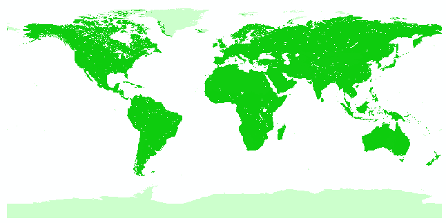

可以发现没什么区别。

### 3. 植被覆盖度

植被覆盖度的计算通常都使用像元二分法来计算：

假设每个像元（像素）的 NDVI 值由植被和土壤两部分组成：
$$
NDVI=NDVI_vC_i+NDVI_s(1-C_i)
$$
其中，$NDVI_v$ 表示植被覆盖部分的值，$NDVI_s$ 表示土壤部分的值，$C_i$ 表示植被覆盖度：
$$
C_i=\frac{NDVI-NDVI_s}{NDVI_v-NDVI_s}
$$
由于植被和土壤部分的 NDVI 值并不能确定，因此通常使用累积概率为 95% 和 5% 来代替，因此公式如下：
$$
C_i=\frac{NDVI-NDVI_{0.05}}{NDVI_{0.95}-NDVI_{0.05}}
$$
下面进行实操，首先提取 NDVI 的累积概率，笔者最开始使用 ENVI 软件的统计功能进行提取，但是因为数据中含有负值，因此统计的结果不正确，而笔者又不知道该如何处理这种问题，因此最终还是使用 Python 代码处理了。

笔者一开始写代码处理计算累积概率的时候使用的是原始数据类型 .asc ，其实处理 .tif 更加简便，这里给出 .asc 文件类型的处理代码，后面在对数据进行再分类的时候会提供处理 .tif 文件类型的代码，有需要的朋友自行改写吧。

```python
# coding=utf-8

import pandas as pd
import numpy as np


def get_confidence(filepath):
    ASCfile = pd.read_csv(filepath, skiprows=6, engine='python', sep=' ', delimiter=None, index_col=False, header=None, skipinitialspace=True)

    ndarray = ASCfile.as_matrix().reshape(1, -1)
    ndarray.sort()
    ndarray = ndarray[ndarray>=-1] # 取正常的NDVI值
    q_5 = np.percentile(ndarray, 5)
    q_95 = np.percentile(ndarray, 95)

    return q_5, q_95
```

植被覆盖度具体的计算可以使用 Arcgis 软件中的栅格计算器：`Spatial Analyst Tools/Map Algebra/Raster Calculator` 。

由于在计算之前需要处理一下数据中的负值，而且对于超出累积概率范围的值也需要清洗，因此处理上文中给出的计算公式外，还需要增加一些步骤：

* 如果 $NDVI<NDVI_{0.05}$ ，则 $NDVI=0$ ；
* 如果 $NDVI>NDVI_{0.95}$ ，则 $NDVI=1$ ；
* 如果 $NDVI_{0.05}\le NDVI\le NDVI_{0.95}$ ，则 $NDVI=NDVI$ 。

因此使用栅格计算器的时候所需的公式为：`(b1 lt ndvi_min)*0 + (b1 gt ndvi_max)*1 + (b1 ge ndvi_min and b1 le  ndvi_max)*((b1 + ndvi_min) / (ndvi_max - ndvi_min))` 。

使用栅格计算器的时候，一次只能处理一个文件，因此需要自行提取累积概率并输入计算器，这样会非常麻烦，因此下面给出批量处理的代码：

```python
# coding=utf-8

import os
import arcpy
from arcpy.sa import *
from get_confidence import get_confidence


arcpy.CheckOutExtension("spatial") # 检查外部扩展
arcpy.gp.overwriteOutput = 1 # 覆盖之前的文件

dirs = 'D:/Documentation/Project/Grassland ecology/Grassland_ecology/data/conversion/'
out_dir = 'D:/Documentation/Project/Grassland ecology/Grassland_ecology/data/Vegetation_coverage/'
asc_dir = 'D:/Documentation/Project/Grassland ecology/Grassland_ecology/data/gimms_ndvi_qd_1981-2002_exp/'
files = os.listdir(dirs)

for file in files:
    if os.path.exists(out_dir + file) == False:
        os.mkdir(out_dir + file)
    out_path = out_dir + file + os.sep
    dir = dirs + file + os.sep
    arcpy.env.workspace = dir
    rasters = arcpy.ListRasters(raster_type='TIF')

    for raster in rasters:
        inRaster = Raster(raster)
        Min, Max = get_confidence(asc_dir + file + ".asc")
        ans = Con(inRaster < Min, 0, Con((inRaster >= Min) & (inRaster <= Max), (inRaster - Min)/(Max - Min), 1))
        ans.save(out_path + file + ".tif")
        print file + " is done!"

print "OK!"
```

植被覆盖度图像如下：

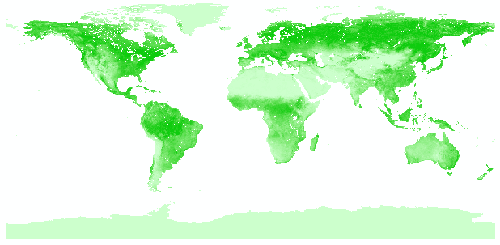

可以发现，它的颜色变浅了一些。

### 4. 截取目标区域

实例以中国为例，因此需要使用国界线从世界区域中截取中国区域，国界线文件需要使用 .shp 等类型，如果没有请自行下载。

对于未定义坐标系的文件，可以使用 Arcgis 软件中的：`Data Management Tools/Projections and Transformations/Define Porjection` 工具来定义坐标系，通常使用 WGS 1984。

对于不相同的坐标系文件，可以使用 Arcgis 软件中的：`Data Management Tools/Projections and Transformations/Project` 工具来转换坐标系，通常使用 WGS 1984。

如果上两步没有问题或者不需要进行上两步，就可以进行区域截取了，使用 Arcgis 软件中的： `Spatial Analyst Tools/Extraction/Extract by Mask'`工具按掩膜提取即可，代码版本如下：

```python
import arcpy
from arcpy import env
from arcpy.sa import *
import os


arcpy.CheckOutExtension("Spatial")
in_path = r"D:\Documentation\Project\Grassland ecology\Grassland_ecology\data\Vegetation_coverage"
mask_data = r"D:\Documentation\Project\Grassland ecology\Grassland_ecology\data\national_borders\national_borders.shp"
out_path = r"D:\Documentation\Project\Grassland ecology\Grassland_ecology\data\extract_by_mask"
dirs = os.listdir(in_path)
flag = 0
for dir in dirs:
    env.workspace = in_path + os.sep + dir
    files = arcpy.ListRasters(raster_type='TIF')
    for file in files:
        out = ExtractByMask(file, mask_data)
        if os.path.exists(out_path + os.sep + file.split('.')[0]) == False:
            os.mkdir(out_path + os.sep + file.split('.')[0])
        out.save(out_path + os.sep + file.split('.')[0] + os.sep + file)
    flag+=1
    print flag
print "ok!"
```

该步骤建议放在转换文件类型之后，这样可以降低计算量。

截取中国后的图像：

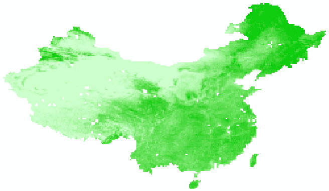

### 5. 提取年代数据

由于要分析植被覆盖度的时空变化，因此需要对已有的数据进行划分。

笔者根据论文[1]，将数据划分为 1980 年代（1982~1989）、1990 年代（1990~1999）和 2000 年代（2000~2002），由于笔者采用的数据并不是论文中采用的数据集，因此后续计算中会出现一些不合理的地方，本文的主要目的是记录学习这些步骤以及做这个实验的过程，因此不需要过于纠结这些问题。

所谓提取年代数据，实际上就是对某一年代的 NDVI 数据取一下均值，得到一份均值数据，该步骤可以使用 Ascgis 软件中的：`Spatial Analyst Tools/Local/Cell Statistics` 工具处理，也可以使用代码处理：

```python
import arcpy
from arcpy import env
from arcpy.sa import *
import os


in_path = r"D:\Documentation\Project\Grassland ecology\Grassland_ecology\data\extract_by_mask"
out_path = r"D:\Documentation\Project\Grassland ecology\Grassland_ecology\data\years_data"
years_path = os.listdir(in_path)
for years in years_path:
    arr = []
    dirs = os.listdir(in_path + os.sep + years)
    for dir in dirs:
        env.workspace = in_path + os.sep + years + os.sep + dir
        files = arcpy.ListRasters(raster_type='TIF')
        for file in files:
            arr.append(in_path + os.sep + years + os.sep + dir + os.sep + file)

    arcpy.CheckOutExtension("Spatial")
    out = CellStatistics(arr, "MEAN")
    if os.path.exists(out_path + os.sep+ years) == False:
        os.mkdir(out_path + os.sep+ years)
    out.save(out_path + os.sep+ years + os.sep + years + '.tif')
print "ok!"
```

提取年代数据后的图像：

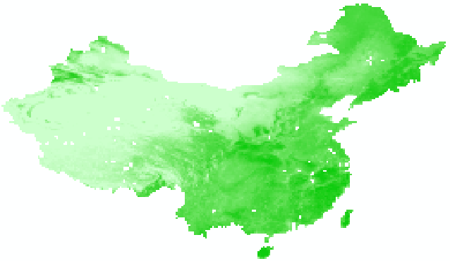

### 6. 划分等级

根据论文，需要将植被覆盖数据划分为五个等级，分别为：

| 等级 |    名称    |                             描述                             |
| :--: | :--------: | :----------------------------------------------------------: |
| Ⅰ级  |  低覆盖度  | 小于 5% ，中度沙漠化土地、裸岩、居民地、水体、 裸体、低产草地，属劣等覆盖 |
| Ⅱ级  | 中低覆盖度 | 5% ~ 15% ，相当于轻度沙漠化土地、中产草地、 低郁闭度林地、零星植被，差覆盖度 |
| Ⅲ级  |  中覆盖度  |         15% ~ 30% ，中低产草地、沼泽类草地，中覆盖度         |
| Ⅳ级  | 中高覆盖度 |              30% ~ 60% ，中高产草地，中高覆盖度              |
| Ⅴ级  |  高覆盖度  | 大于 60% ，高产草地、密灌木地、密林地、属于优 等覆盖，高覆盖度植被 |

该步骤可以使用 Ascgis 软件中的：`Spatital Analyst Tools/Reclass/Reclassify` 工具进行划分，代码版本如下：

```python
# coding=utf-8
import numpy as np
import arcpy
from arcpy.sa import *


def load_img_to_array(img_file_path):
    inRas = arcpy.Raster(img_file_path)
    lowerLeft = arcpy.Point(inRas.extent.XMin, inRas.extent.YMin)
    ndarray = arcpy.RasterToNumPyArray(inRas)
    ndarray = ndarray.reshape(1, -1)
    ndarray.sort()
    ndarray = ndarray[ndarray>=-1] # 取正常的NDVI值
    q_5 = np.percentile(ndarray, 5)
    q_15 = np.percentile(ndarray, 15)
    q_30 = np.percentile(ndarray, 30)
    q_60 = np.percentile(ndarray, 60)

    return [[0, q_5, 0], [q_5, q_15, 1], [q_15, q_30, 2], [q_30, q_60, 3], [q_60, 1, 4]]

in_path1 = r"D:\Documentation\Project\Grassland ecology\Grassland_ecology\data\years_data\1980s\1980s.tif"
in_path2 = r"D:\Documentation\Project\Grassland ecology\Grassland_ecology\data\years_data\1990s\1990s.tif"
in_path3 = r"D:\Documentation\Project\Grassland ecology\Grassland_ecology\data\years_data\2000s\2000s.tif"

p1 = load_img_to_array(in_path1)
p2 = load_img_to_array(in_path2)
p3 = load_img_to_array(in_path3)

out_path1 = r"D:\Documentation\Project\Grassland ecology\Grassland_ecology\data\reclassify\1980s\1980s.tif"
out_path2 = r"D:\Documentation\Project\Grassland ecology\Grassland_ecology\data\reclassify\1990s\1990s.tif"
out_path3 = r"D:\Documentation\Project\Grassland ecology\Grassland_ecology\data\reclassify\2000s\2000s.tif"

out1 = Reclassify(in_path1, "Value", RemapRange(p1))
out2 = Reclassify(in_path2, "Value", RemapRange(p2))
out3 = Reclassify(in_path3, "Value", RemapRange(p3))

out1.save(out_path1)
out2.save(out_path2)
out3.save(out_path3)
```

上述代码中的函数 `load_img_to_array(img_file_path)` 可以修改为累积概率提取的 .tif 文件类型版本。

划分等级后的图像：

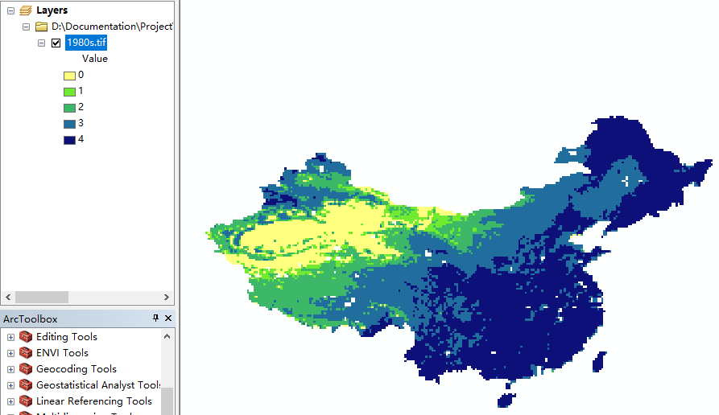

### 7. 计算转移矩阵

要分析植被覆盖的变化，还需要计算转移矩阵。

所谓转移矩阵，实际上就是随时间变化，上一年代的某植被覆盖等级的像元逐渐演化为了其他等级，用来统计这些变化信息的矩阵。

笔者尝试了使用 Arcgis 软件来进行计算，但是该软件提供的工具要求使用向量文件，而且得到的结果是面积演化的转移矩阵，不符合我们的目标。

这里推荐使用 ENVI 软件来计算，首先需要使用 ENVI Classic 软件将 .tif 文件绘制为 ENVI 文件可应用的图像，步骤如下：

* 打开 ENVI Classic 软件；

* 导入划分等级后的 .tif 文件；

* 打开图片；

* 点击：`Tools/Color Mapping/Density Slice` ；

  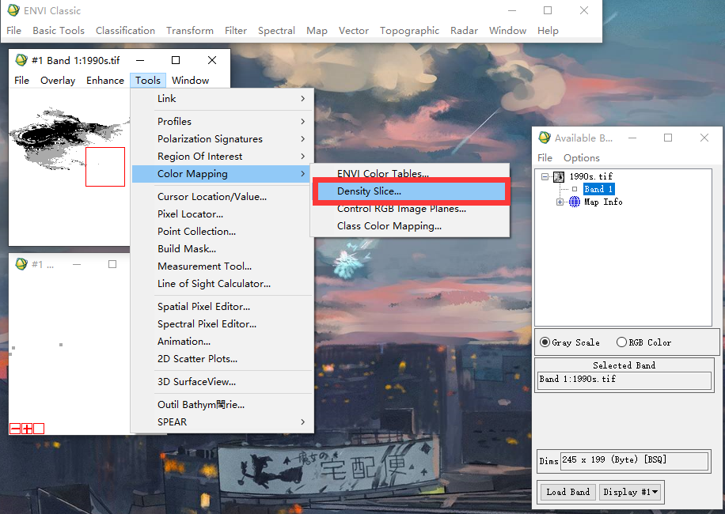

* 点击 `ok` ；

* 将 Range 范围改为五个类别，分别为：

  * `0 to 0`
  * `1 to 1`
  * `2 to 2`
  * `3 to 3`
  * `4 to 4`

* 点击 `Apply` ；

  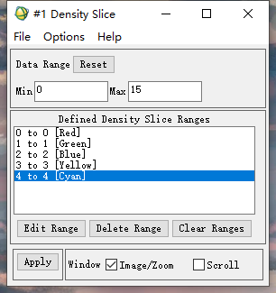

* 点击 `File/Output Ranges to Class Image` ；

  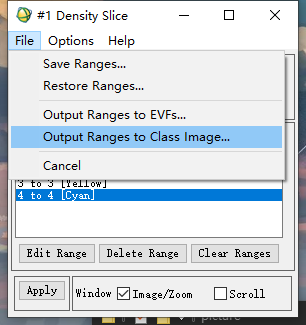

* 输入保存路径保存图片。

对三个年代数据文件处理后，就可以使用 ENVI 软件的：`Change Detection/Change Detection Statistics` 工具计算转移矩阵了，步骤如下：

* 打开工具；
* 先选择后一年代的文件，再选择前一年代的文件；
* 点击 `ok` ；
* 输入文件保存路径，点击 `ok` 。
* 点击：`File/Save to Text File`，输入文件路径将弹出的表格保存；
* 打开 Excel ；
* 打开刚才保存的 .txt 文件，分隔方式为 Tab ，不懂的自行百度 excel 打开 txt 文件；
* 将表格中的数据进行处理，修改为你想要样子。

转移矩阵展示：

| 植被覆盖等级 |  Ⅰ   |  Ⅱ   |  Ⅲ   |  Ⅳ   |  Ⅴ   | 起始 | 减少 |
| :----------: | :--: | :--: | :--: | :--: | :--: | :--: | :--: |
|      Ⅰ       | 1551 |  99  |  0   |  0   |  0   | 1650 |  99  |
|              | 1616 |  21  |  0   |  0   |  0   | 1637 |  21  |
|      Ⅱ       |  84  | 457  |  80  |  0   |  0   | 621  | 164  |
|              | 229  | 332  |  73  |  0   |  0   | 634  | 302  |
|      Ⅲ       |  2   |  78  | 2137 |  54  |  0   | 2271 | 134  |
|              |  8   |  65  | 2124 |  74  |  0   | 2271 | 147  |
|      Ⅳ       |  0   |  0   |  54  | 4313 | 175  | 4542 | 229  |
|              |  0   |  0   |  74  | 4251 | 217  | 4542 | 291  |
|      Ⅴ       |  0   |  0   |  0   | 175  | 5881 | 6056 | 175  |
|              |  0   |  0   |  0   | 217  | 5839 | 6056 | 217  |
|     最终     | 1637 | 634  | 2271 | 4542 | 6056 |      |      |
|              | 1853 | 418  | 2271 | 4542 | 6056 |      |      |
|     增加     |  86  | 177  | 134  | 229  | 175  |      |      |
|              | 237  |  86  | 147  | 291  | 217  |      |      |

### 8. 结果分析

面积统计如下表：（总面积为：420892）

| 年代         | 属性        | Ⅰ        | Ⅱ        | Ⅲ       | Ⅳ        | Ⅴ        |
| ------------ | ----------- | -------- | -------- | ------- | -------- | -------- |
| 1982-1989    | 面积/km²    | 45870    | 17263.8  | 63133.8 | 126267.6 | 168356.8 |
|              | 比例/%      | 10.89828 | 4.101717 | 15      | 30       | 40       |
| 1990-1999    | 面积/km²    | 45508.6  | 17625.2  | 63133.8 | 126267.6 | 168356.8 |
|              | 比例/%      | 10.81242 | 4.187583 | 15      | 30       | 40       |
| 2000-2002    | 面积/km²    | 51513.4  | 11620.4  | 63133.8 | 126267.6 | 168356.8 |
|              | 比例/%      | 12.2391  | 2.760898 | 15      | 30       | 40       |
| 面积变化/km² | 1980s-1990s | -361.4   | 361.4    | 0       | 0        | 0        |
|              | 1990s-2000s | 6004.8   | -6004.8  | 0       | 0        | 0        |

## 三、强度分析

强度分析是一种定量分析土地利用/土地覆盖变化，适用于两个或两个以上时间段以及两个或两个以上不同类型的分析方法，包含 3 个层面：时间间隔、类别、转换。

### 1. 层面一

第 1 个层面分析每个时间间隔的总体变化规模和变化速率的大小，称之为间隔层面，计算每个时间间隔的年变化强度之后与均值线对比其变化速率的快慢。由下面公式 1 计算每个时间段的变化面积百分比；
$$
S_t = \frac{\frac{[Y_t, Y_{t+1}]期间的变化面积}{研究区面积}}{[Y_t,Y_{t+1}]的持续时间}\times100\%=\frac{\frac{\sum_{j=1}^J[(\sum_{i=1}^Jc_{tij})-c_{tij}]}{\sum_{j=1}^J\sum_{i=1}^Jc_{tij}}}{Y_{t+1}-Y_t}\times100\%
$$
其中：

* $S_t$ 为时间段 $[Y_t,Y_{t+1}]$ 的年变化强度；
* $J$ 为类别数量；
* 下标 $i$ 表示某时间段初始时间点的类别；
* 下标 $j$ 表示某时间段终止时间点的类别；
* 下标 $n$ 表示由其他类别转换而来的类别；
* $T$ 为时间段的数量；
* 下标 $t$ 是 $[Y_t,Y_{t+1}]$ 期间的某一时间点，范围是 $[1,T-1]$ ；
* $Y_t$ 为时间点 $t$ 的年份。

公式 2 给出了变化速率均值线，如果 $S_t$ 的值在每个时间点 $t$ 都相等，则 $S_t$ 的值等于 $U$ ，这是强度分析的基本逻辑，并适用于类别层面和转换层面的分析：
$$
U=\frac{\frac{整个研究时段内的面积变化}{研究区面积}}{整个期间持续时间}\times100\%=\frac{\frac{\sum_{t=1}^{T-1}\left\{\sum_{j=1}^J[(\sum_{i=1}^JC_{tij})-C_{tij}]\right\}}{\sum_{j=1}^J\sum_{i=1}^JC_{tij}}}{Y_T-Y_1}\times100\%
$$
$U$ 为时间 Intensity analysis 均值线的值。

下图展示了两个时段的面积变化和面积变化速率，左图 x 轴表示时段，y 轴表示年平均面积变化量，右图 y 轴表示年平均面积变化速率百分比，红色的虚线为均值线，可以看出：中国植被覆盖度在 1980s — 1990s 的变化面积和变化速率均小于 1990s — 2000s。

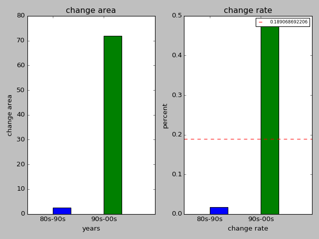

### 2. 层面二

分析每个类别在某一时间段增加或减少的程度，并将其与均值线对比可知其变化速率的缓急情况：
$$
G_{tj}=\frac{\frac{[Y_t,Y_{t+1}]期间内类型j的增加面积}{[Y_t, Y_{t+1}]的持续时间}}{类型j在Y_{t+1}的面积}\times100\%=\frac{\frac{(\sum_{i=1}^Jc_{tij})-c_{tii}}{Y_{t+1}-Y_t}}{\sum_{i=1}^Jc_{tij}}\times100\% \\ 
L_{ti}=\frac{\frac{[Y_t,Y_{t+1}]期间内类型i的减少面积}{[Y_t,Y_{t+1}]的持续时间}}{类型i在Y_t的面积}\times100\%=L_{ti}=\frac{\frac{(\sum_{j=1}^Jc_{tij})-c_{tii}}{Y_{t+1-Y_t}}}{\sum_{j=1}^Jc_{tij}}\times100\%
$$
其中：

* $G_{tj}$ 为 $[Y_t,Y_{t+1}]$ 中 $j$ 等级的年总增加强度；
* $L_{ti}$ 为从时间点 $Y_t$ 的 $i$ 等级转换至时间点 $Y_{t+1}$ 的 $j$ 等级的像元个数。

下面的图像展示了两个时段的植被覆盖度等级变化规律，左图 x 轴表示植被覆盖等级，y 轴表示年平均变化面积，右图 x 轴表示植被覆盖等级，y 轴表示面积变化速率百分比，红色的虚线表示均值线 。均值线以下表示强度变化平缓，反之表示强度变化活跃。

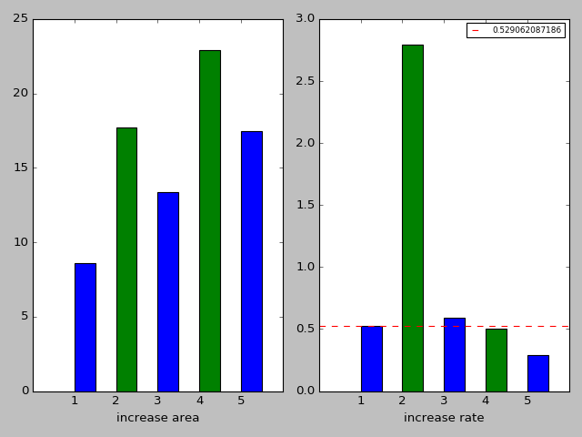

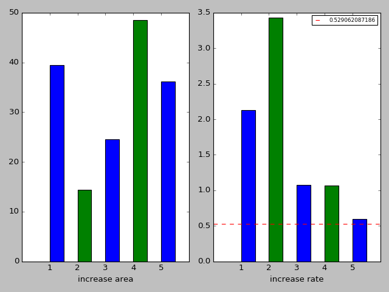

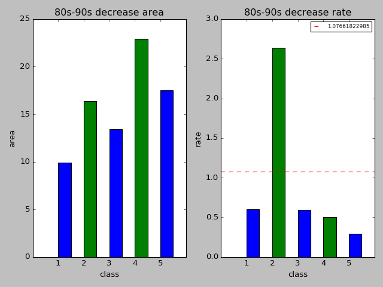

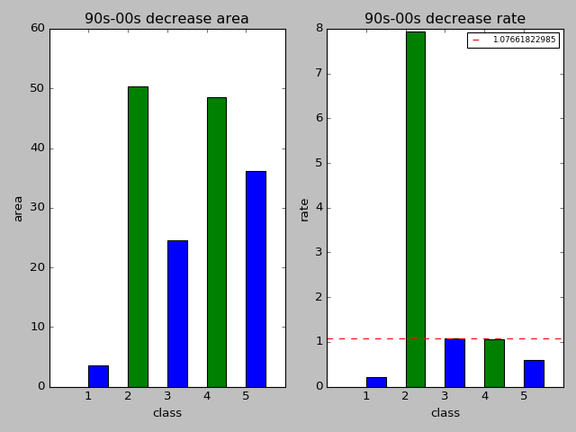

### 3. 层面三

分析某一类别转换为另一类别和其他类别转入该类别的程度，并找出在某一特定时间间隔内哪种类别的转换尤为强烈：
$$
R_{tin}=\frac{\frac{[Y_t,Y_{t+1}]期间内i转至n的面积}{[Y_t,Y_{t+1}]的持续时间}}{类型i在Y_t的面积}\times100\%=\frac{\frac{c_{tin}}{Y_{t+1}-Y_t}}{\sum_{j=1}^Jc_{tij}}\times100\%
$$

* $R_{tin}$ 为 $[Y_t,Y_{t+1}]$ 中 $i$ 等级至 $n(i\ne n)$ 等级的年转换强度。

$$
W_{tn}=\frac{\frac{[Y_t,Y_{t+1}]期间内类型n的增加面积}{[Y_t,Y_{t+1}]的持续时间}}{在Y_t的非类型n的面积}\times100\%=\frac{\frac{(\sum_{i=1}^Jc_{tin})-c_{tnn}}{Y_{t+1}-Y_t}}{\sum_{j=1}^J[(\sum_{i=1}^Jc_{tij})-c_{tnj}]}\times100\%
$$

* $W_{tn}$ 为 $[Y_t,Y_{t+1}]$ 中从时间点 $Y_t$ 的非 $n$ 等级至 $n$ 等级的统一转换强度。

$$
Q_{tmj}=\frac{\frac{[Y_t,Y_{t+1}]期间内m转至j的面积}{[Y_t,Y_{t+1}]的持续时间}}{类型j在Y_{t+1}的面积}\times100\%=\frac{\frac{c_{tmj}}{Y_{t+1-Y_t}}}{\sum_{i=1}^Jc_{tij}}\times100\%
$$

* $Q_{tmj}$ 为 $[Y_t,Y_{t+1}]$ 中 $m$ 等级至 $(m\ne j)$ 等级的年转换强度。

$$
V_{tm}=\frac{\frac{[Y_t,Y_{t+1}]期间m的减少面积}{[Y_t,Y_{t+1}]的持续时间}}{在Y_{t+1}的非类型m的面积}\times100\%=\frac{\frac{(\sum_{j=1}^Jc_{tmj})-c_{tmm}}{Y_{t+1}-Y_t}}{\sum_{i=1}^J[(\sum_{j=1}^Jc_{tij})-c_{tim}]}\times100\%
$$

* $V_{tm}$ 为 $[Y_t,Y_{t+1}]$ 中从时间点 $Y_{t+1}$ 的 $m$ 等级至所有非 $m$ 等级的统一转换强度。

根据强度分析，得到下表的变化趋势：

|      转出       |       80s-90s        |       90s-00s        |
| :-------------: | :------------------: | :------------------: |
|  低覆盖度（1）  |      中低（2）       |      中低（2）       |
| 中低覆盖度（2） |   低（1）、中（3）   |   低（1）、中（3）   |
|  中覆盖度（3）  | 中低（2）、中高（4） | 中低（2）、中高（4） |
| 中高覆盖度（4） |   中（3）、高（5）   |   中（3）、高（5）   |
|  高覆盖度（5）  |      中高（5）       |      中高（5）       |

### 4. 强度分析代码

```python
import numpy as np


class strength_analysis:
    # init
    def __init__(self):
        self.category_80s = np.array([1650, 621, 2271, 4542, 6056], dtype='double')
        self.category_90s = np.array([1637, 634, 2271, 4542, 6056], dtype='double')
        self.category_00s = np.array([1853, 418, 2271, 4542, 6056], dtype='double')
        self.years_80s_90s = 10
        self.years_90s_00s = 6
        self.years_80s_00s = 16
        self.var_80s_90s = np.array([[1551, 99, 0, 0, 0], [84, 457, 80, 0, 0], [2, 78, 2137, 54, 0], [0, 0, 54, 4313, 175],
                                [0, 0, 0, 175, 5881]], dtype='double')
        self.var_90s_00s = np.array([[1616, 21, 0, 0, 0], [229, 332, 73, 0, 0], [8, 65, 2124, 74, 0], [0, 0, 74, 4251, 217],
                                [0, 0, 0, 217, 5839]], dtype='double')
        self.increase_80s_90s = np.array([86, 177, 134, 229, 175], dtype='double')
        self.increase_90s_00s = np.array([237, 86, 147, 291, 217], dtype='double')
        self.decrease_80s_90s = np.array([99, 164, 134, 229, 175], dtype='double')
        self.decrease_90s_00s = np.array([21, 302, 147, 291, 217], dtype='double')

    # category 1
    def S_U(self):
        S_80s_90s = np.sum(np.abs(self.category_90s - self.category_80s)) / sum(self.category_80s) / self.years_80s_90s * 100
        S_90s_00s = sum(np.abs(self.category_00s - self.category_90s)) / sum(self.category_90s) / self.years_90s_00s * 100
        U = (sum(np.abs(self.category_90s - self.category_80s)) + sum(np.abs(self.category_00s - self.category_90s))) / sum(self.category_80s) / self.years_80s_00s * 100
        return S_80s_90s, S_90s_00s, U

    def area_S(self):
        S_80s_90s = np.sum(np.abs(self.category_90s - self.category_80s)) / self.years_80s_90s
        S_90s_00s = sum(np.abs(self.category_00s - self.category_90s)) / self.years_90s_00s
        return S_80s_90s, S_90s_00s

    # category 2
    def GL(self):
        G_80s_90s = np.empty((5, 1), dtype='double')
        G_90s_00s = np.empty((5, 1), dtype='double')
        L_80s_90s = np.empty((5, 1), dtype='double')
        L_90s_00s = np.empty((5, 1), dtype='double')
        for i in range(5):
            G_80s_90s[i] = self.increase_80s_90s[i] / self.years_80s_90s / self.category_90s[i] * 100
            G_90s_00s[i] = self.increase_90s_00s[i] / self.years_90s_00s / self.category_00s[i] * 100
            L_80s_90s[i] = self.decrease_80s_90s[i] / self.years_80s_90s / self.category_80s[i] * 100
            L_90s_00s[i] = self.decrease_90s_00s[i] / self.years_90s_00s / self.category_90s[i] * 100
        U1 = np.sum(self.increase_80s_90s) / sum(self.category_80s) / self.years_80s_90s * 100
        U2 = np.sum(self.increase_90s_00s) / sum(self.category_90s) / self.years_90s_00s * 100
        U3 = np.sum(self.decrease_80s_90s) / sum(self.category_80s) / self.years_80s_90s * 100
        U4 = np.sum(self.decrease_90s_00s) / sum(self.category_90s) / self.years_90s_00s * 100
        return G_80s_90s, G_90s_00s, L_80s_90s, L_90s_00s, U1, U2, U3, U4

    def area_GL(self):
        G_80s_90s = np.empty((5, 1), dtype='double')
        G_90s_00s = np.empty((5, 1), dtype='double')
        L_80s_90s = np.empty((5, 1), dtype='double')
        L_90s_00s = np.empty((5, 1), dtype='double')
        for i in range(5):
            G_80s_90s[i] = self.increase_80s_90s[i] / self.years_80s_90s
            G_90s_00s[i] = self.increase_90s_00s[i] / self.years_90s_00s
            L_80s_90s[i] = self.decrease_80s_90s[i] / self.years_80s_90s
            L_90s_00s[i] = self.decrease_90s_00s[i] / self.years_90s_00s
        return G_80s_90s, G_90s_00s, L_80s_90s, L_90s_00s

    # category 3
    def RWQV(self):
        R_80s_90s = np.empty((5, 5), dtype='double')
        R_90s_00s = np.empty((5, 5), dtype='double')
        W_80s_90s = np.empty((5, 1), dtype='double')
        W_90s_00s = np.empty((5, 1), dtype='double')
        Q_80s_90s = np.empty((5, 5), dtype='double')
        Q_90s_00s = np.empty((5, 5), dtype='double')
        V_80s_90s = np.empty((5, 1), dtype='double')
        V_90s_00s = np.empty((5, 1), dtype='double')
        for i in range(5):
            for j in range(5):
                if i == j:
                    continue
                R_80s_90s[i][j] = self.var_80s_90s[i][j] / self.years_80s_90s / self.category_80s[i] * 100
                R_90s_00s[i][j] = self.var_90s_00s[i][j] / self.years_90s_00s / self.category_90s[i] * 100
                Q_80s_90s[i][j] = self.var_80s_90s[i][j] / self.years_80s_90s / self.category_90s[j] * 100
                Q_90s_00s[i][j] = self.var_90s_00s[i][j] / self.years_90s_00s / self.category_00s[j] * 100
            W_80s_90s[i] = self.increase_80s_90s[i] / self.years_80s_90s / (np.sum(self.category_80s) - self.category_80s[i]) * 100
            W_90s_00s[i] = self.increase_90s_00s[i] / self.years_90s_00s / (np.sum(self.category_90s) - self.category_90s[i]) * 100
            V_80s_90s[i] = self.decrease_80s_90s[i] / self.years_80s_90s / (np.sum(self.category_90s) - self.category_90s[i]) * 100
            V_90s_00s[i] = self.decrease_90s_00s[i] / self.years_90s_00s / (np.sum(self.category_00s) - self.category_00s[i]) * 100

        return R_80s_90s, R_90s_00s, W_80s_90s, W_90s_00s, Q_80s_90s, Q_90s_00s, V_80s_90s, V_90s_00s
```

### 5. 画图代码

```python
# coding=utf-8

from strength_analysis import *
import numpy
import matplotlib.pyplot as plt


SA = strength_analysis()

# plot 1
plt.clf()
S_80s_90s, S_90s_00s = SA.area_S()
plt.subplot(1, 2, 1)
plt.title('change area')
plt.xlabel("years") # 变化面积
plt.ylabel("change area") # 变化面积
plt.xlim(0, 5)
plt.xticks([1, 3], ['80s-90s', '90s-00s'])
plt.bar([1, 3], [S_80s_90s, S_90s_00s], color=['blue', 'green'], width=0.7)
plt.tight_layout()
# plt.show()

# plot 2
S_80s_90s, S_90s_00s, U = SA.S_U()
plt.subplot(1, 2, 2)
plt.title('change rate')
plt.xlabel("change rate") # 变化率
plt.ylabel("percent") # 变化面积
plt.xlim(0, 5)
plt.xticks([1, 3], ['80s-90s', '90s-00s'])
plt.bar([1, 3], [S_80s_90s, S_90s_00s], color=['blue', 'green'], width=0.7)
plt.axhline(U, linestyle='--', c='red', label=str(U))
plt.legend(fontsize=8)
plt.tight_layout()
# plt.show()

# plot 3
plt.clf()
G_80s_90s, G_90s_00s, L_80s_90s, L_90s_00s = SA.area_GL()
plt.subplot(1, 2, 1)
plt.title('80s-90s increase area')
plt.xlabel("class") # 变化面积
plt.ylabel("area") # 变化面积
plt.xlim(0, 6)
plt.xticks([1, 2, 3, 4, 5], [1, 2, 3, 4, 5])
plt.bar([1, 2, 3, 4, 5], G_80s_90s, color=['blue', 'green'], width=0.5)
plt.tight_layout()
# plt.show()

# plot 4
G_80s_90s, G_90s_00s, L_80s_90s, L_90s_00s, U1, U2, U3, U4 = SA.GL()
plt.subplot(1, 2, 2)
plt.title('80s-90s increase rate')
plt.xlabel("class") # 变化率
plt.ylabel("rate") # 变化面积
plt.xlim(0, 6)
plt.xticks([1, 2, 3, 4, 5], [1, 2, 3, 4, 5])
plt.bar([1, 2, 3, 4, 5], G_80s_90s, color=['blue', 'green'], width=0.5)
plt.axhline(U1, linestyle='--', c = 'red', label=str(U1))
plt.legend(fontsize=8)
plt.tight_layout()
plt.show()

# plot 5
plt.clf()
G_80s_90s, G_90s_00s, L_80s_90s, L_90s_00s = SA.area_GL()
plt.subplot(1, 2, 1)
plt.title('90s-00s increase area')
plt.xlabel("class") # 变化率
plt.ylabel("area") # 变化面积
plt.xlim(0, 6)
plt.xticks([1, 2, 3, 4, 5], [1, 2, 3, 4, 5])
plt.bar([1, 2, 3, 4, 5], G_90s_00s, color=['blue', 'green'], width=0.5)
plt.tight_layout()
# plt.show()

# plot 6
G_80s_90s, G_90s_00s, L_80s_90s, L_90s_00s, U1, U2, U3, U4 = SA.GL()
plt.subplot(1, 2, 2)
plt.title('90s-00s increase rate')
plt.xlabel("class") # 变化率
plt.ylabel("rate") # 变化面积
plt.xlim(0, 6)
plt.xticks([1, 2, 3, 4, 5], [1, 2, 3, 4, 5])
plt.bar([1, 2, 3, 4, 5], G_90s_00s, color=['blue', 'green'], width=0.5)
plt.axhline(U1, linestyle='--', c = 'red', label=str(U2))
plt.legend(fontsize=8)
plt.tight_layout()
plt.show()

# plot 7
plt.clf()
G_80s_90s, G_90s_00s, L_80s_90s, L_90s_00s = SA.area_GL()
plt.subplot(1, 2, 1)
plt.title('80s-90s decrease area')
plt.xlabel("class") # 变化率
plt.ylabel("area") # 变化面积
plt.xlim(0, 6)
plt.xticks([1, 2, 3, 4, 5], [1, 2, 3, 4, 5])
plt.bar([1, 2, 3, 4, 5], L_80s_90s, color=['blue', 'green'], width=0.5)
plt.tight_layout()
# plt.show()

# plot 8
G_80s_90s, G_90s_00s, L_80s_90s, L_90s_00s, U1, U2, U3, U4 = SA.GL()
plt.subplot(1, 2, 2)
plt.title('80s-90s decrease rate')
plt.xlabel("class") # 变化率
plt.ylabel("rate") # 变化面积
plt.xlim(0, 6)
plt.xticks([1, 2, 3, 4, 5], [1, 2, 3, 4, 5])
plt.bar([1, 2, 3, 4, 5], L_80s_90s, color=['blue', 'green'], width=0.5)
plt.axhline(U2, linestyle='--', c = 'red', label=str(U3))
plt.legend(fontsize=8)
plt.tight_layout()
plt.show()

# plot 9
plt.clf()
G_80s_90s, G_90s_00s, L_80s_90s, L_90s_00s = SA.area_GL()
plt.subplot(1, 2, 1)
plt.title('90s-00s decrease area')
plt.xlabel("class") # 变化率
plt.ylabel("area") # 变化面积
plt.xlim(0, 6)
plt.xticks([1, 2, 3, 4, 5], [1, 2, 3, 4, 5])
plt.bar([1, 2, 3, 4, 5], L_90s_00s, color=['blue', 'green'], width=0.5)
plt.tight_layout()
# plt.show()

# plot 10
G_80s_90s, G_90s_00s, L_80s_90s, L_90s_00s, U1, U2, U3, U4 = SA.GL()
plt.subplot(1, 2, 2)
plt.title('90s-00s decrease rate')
plt.xlabel("class") # 变化率
plt.ylabel("rate") # 变化面积
plt.xlim(0, 6)
plt.xticks([1, 2, 3, 4, 5], [1, 2, 3, 4, 5])
plt.bar([1, 2, 3, 4, 5], L_90s_00s, color=['blue', 'green'], width=0.5)
plt.axhline(U2, linestyle='--', c = 'red', label=str(U4))
plt.legend(fontsize=8)
plt.tight_layout()
plt.show()

R_80s_90s, R_90s_00s, W_80s_90s, W_90s_00s, Q_80s_90s, Q_90s_00s, V_80s_90s, V_90s_00s = SA.RWQV()
for i in range(5):
    for j in range(5):
        if i == j:
            continue
        print "R_90s_00s[{}][{}]:{}".format(i, j, R_90s_00s[i][j]) # 4 to 5
```

**如果本项目帮助到了你，不如用微信赞助作者一杯奶茶吧~~~**


